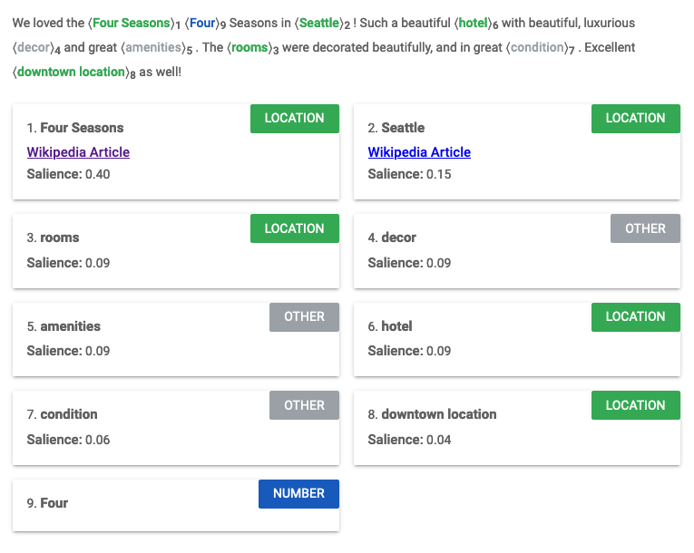

# IGUR (Instagram User Report)

# 프로젝트 소개

제 프로젝트 **IGUR** (Instagram User Report)는 검색된 인스타그램 사용자에 대한 보고서를 만들어주는 서비스입니다. 

검색된 사용자 정보를 크롤링하고, 자연어 및 이미지 처리를 하여 보고서를 제작해줍니다.

# **프로젝트 동기**

아이디어를 구상하며 고려했던 사항은 다음과 같습니다:

## 1. 소프트웨어 및 IT의 장점 활용하기

원하는 서비스에서 API를 제공하지 않을 때에 자주 아쉬웠습니다. 그래서 Chrome DevTools 팀이 관리하는 Puppeteer 라이브러리를 활용하여 크롤링을 통해 저만의 데이터를 만들어보고자 했습니다.

## 2. 프론트엔드 및 백엔드 전반적인 흐름 경험하기

실무에 투입되기 이전에 혼자서 프론트엔드와 백엔드를 구축하여 웹 개발 실력을 견고히 하고 싶었습니다.

## 3. 평소에 꺼려했던 라이브러리 및 툴 많이 경험하기

평소에 사용하기 두려워했던 라이브러리를 사용하며 라이브러리 사용에 대한 두려움을 떨쳐내보고 싶었습니다. d3.js(차트 제작), google cloud natural language api(자연어 처리), 그리고 tensorflow.js(이미지 객체 감지)를 사용하여 프로젝트를 진행했습니다.

# **프로젝트 설명**

## 1. 크롤링하기 - Puppeteer

Puppeteer는 UI 테스팅 및 자동화를 돕는 라이브러리입니다. 사람이 브라우저에서 할 수 있는 행동을 코드로 직접 작성해서 실행할 수 있습니다. 저는 제 목적에 맞게 **인스타그램 크롤링**을 하기로 결정했습니다.

크롤링 순서를 말로 풀어보면 다음과 같습니다:

<aside>
➡️ 인스타그램 웹사이트로 이동 
→ 로그인, 비밀번호 입력 창에 본인 계정 정보 입력 
→ 로그인 버튼 클릭 
→ 원하는 인스타그램 계정 페이지로 이동 
→ 페이지 끝까지 계속 스크롤링 하기 
→ 각 게시글 클릭하기 
→ 사진 소스, 좋아요 갯수, 댓글 갯수, 등록된 날짜, 위치 정보 등을 가져오기 
→ 나만의 데이터 (json 형식)로 만들기

</aside>

puppeteer을 통해 인스타그램의 cnn 계정을 들어가고자 한다면 아래처럼 코드를 작성할 수 있습니다:

```jsx
// <Node.js 환경>
const puppeteer = require('puppeteer');

(async () => {
  await page.goto("https://www.instagram.com/accounts/login", {
    waitUntil: "networkidle2",
  });
  await page.type("input[name=username]", process.env.INSTAGRAM_ID, { delay: 200 });
  await page.waitForTimeout(5000);
  await page.type("input[name=password]", process.env.INSTAGRAM_PW, { delay: 200 });
  await page.waitForTimeout(5000);
  await page.click("button[type=submit]", { delay: 100 });
  await page.waitForNavigation({ waitUntil: "networkidle2" });
  await page.goto("https://www.instagram.com/cnn", {
    waitUntil: "networkidle2",
  });
})();
```

## 2. 데이터 분석하기 - Google Cloud Natural Language API

Google Cloud Natural Language API(구글 자연어 처리 API)로 인스타그램 사용자 게시글을 개별적으로 분석하였습니다. 

예시를 위해 호텔 숙박에서 좋은 경험을 한 분의 리뷰를 준비하였습니다. 자연어 처리가 어떤 식으로 이뤄지는지 보여드리겠습니다.

> We loved the Four Seasons in Seattle! Such a beautiful hotel with beautiful, luxurious decor and great amenities. The rooms were decorated beautifully, and in great condition. Excellent downtown location as well!
> 

### 1) 항목 분석(entity analysis)



문장에 어떠한 항목이 존재하는지 구분해줍니다. 유의미한 데이터 위주로 보여주기 위해 분석된 결과에서 metadata에 wikipedia url이 존재하는 것들만 추출하였습니다. 

```jsx
if (entity.metadata && entity.metadata["wikipedia_url"]) {
	// ...필요한 entity frequency counter object 생성 코드
}
```

### 2) 카테고리 분석(category analysis)


예시로 든 리뷰가 **여행/호텔 및 숙박업**에 속하고, 맞을 가능성을 0.83/1.0으로 보여주고 있습니다. 거진 확실하다는 뜻입니다.

### 3) 감정 분석(sentiment analysis)


score는 -1.0에서 1.0 사이의 값으로 -1.0에 가까워질수록 문장이 부정적 감정에 가깝고, 1.0에 가까울수록 문장에 긍정적 감정에 가깝습니다. 예시 문장은 호텔에 대한 칭찬이기 때문에 문서 전체가 0.9의 좋은 점수를 받고 있습니다. 

magnitude는 감정의 강도를 나타냅니다. 0부터 +infinity의 범위를 가집니다. magnitude는 score가 극단에 가까울 수록 강하게 나타납니다. 그리고 이는 누적되기 때문에 문장이 많을수록 더 큰 수치를 보입니다. 

magnitude는 다음의 경우에 유용합니다: 만약 두 개의 문장이 주어졌고 각 문장이 강한 긍정(+1.0)과 강한 부정(-1.0)에 가깝다면 서로 상쇄되어 score가 0에 가깝게 나타납니다. 

이러한 경우에 두 문장이 score가 0에 가까워서 문서 점수가 0에 가깝게 나타나는 건지, 아니면 두 문장의 score가 -1.0과 1.0을 넘나들고 이가 서로 상쇄되어 0에 가깝게 나타나는지 알 수 없습니다. 

이 경우에 magnitude 수치가 작다면 전자를 나타낸다고 보면 되고, 그렇지 않다면 후자를 나타낸다고 보면 됩니다.

## 3. 데이터 분석 - Tensorflow.js - Object Detection (Coco-ssd)
<details>
    <summary>(토글) 선택 과정</summary>
    
    Tensorflow.js의 Coco-ssd 모델을 사용한 Object Detection을 결정하기까지 다음의 과정이 있었습니다:
    
    컴퓨터 비전 분야에서 이미지 안의 물체를 분류함에 있어 세 개의 개념이 있습니다: 
    
    1. Image Classification
    - 이미지 내의 한 사물만 특정 가능
    1. Object Detection
    - 이미지 내의 여러 사물 특정 가능
    - Image Localization을 통해 사물이 이미지 내에서 어디에 위치해있는지 알 수 있음
    1. Image Segmentation
    - 이미지 내의 여러 사물 특정 가능
    - 이미지 내에서 어떤 사물이 어느 픽셀을 차지하고 있는지 알 수 있음
    
    2번과 3번의 차이는 아래의 사진을 보면 좀 더 명확하게 이해할 수 있습니다.
    
    
    
    
    
    사실 3번 Image Segmentation을 통해 좀 더 재밌는 화면을 보여주고 싶었으나, 분석하는 데에 시간도 오래 걸리고, Image Segmentation의 사전학습된 모델이 특정 분야에 특화되어 있거나 불필요한 정보까지 알려줘 범용성이 떨어졌습니다. 그래서 2번 Object Detection으로 진행하게 되었습니다(여기서도 YOLO 및 Coco-ssd 모델로 나뉘어져 있는데 둘의 장단을 따져봤을 때 Coco-ssd가 낫다고 판단하여 이로 진행하였습니다).
</details>

크롤링한 인스타그램 사진 게시글에 어떠한 사물이 있는지 보여주고 싶었습니다. 처음엔 단순히 이미지 소스 url만 긁어와서 새 img 태그에 꽂아넣었습니다. 문제는 이미지 소스가 cdn url이었던 것입니다. 인스타그램 안에서는 예측 가능한 origin이 fetch 요청을 하니 사진을 불러오는 데에 문제가 없었습니다. 하지만 제 서비스에서 fetch를 하려니 예측하지 못한 origin이 이미지를 달라고 요청하여 계속해서 문제를 일으켰습니다.

이를 우회하기 위해 이미지를 백엔드에서 요청하는 방법을 적용했습니다. 

```jsx
async function fetchImageInBuffer(url) {
  const res = await axios({ method: "get", url, responseType: "arraybuffer" });

  return res.data;
}
```

이미지를 array buffer로 받고, 이를 coco-ssd를 활용해 분석했습니다. 

```jsx
async function getPredictions(imgBuffer) {
  const Uint32Array = new Uint8Array(imgBuffer);
  const imgTensor = tf.node.decodeImage(Uint32Array);
  const model = await cocoSsd.load();
  const predictions = await model.detect(imgTensor);

  return predictions;
}
```


@justinbieber instagram

받아온 predictions를 가지고 캔버스에 bbox(bounding box) 좌표를 활용해 다음과 같이 그려주었습니다.

[IGUR_frontend readme에서 이어집니다](https://github.com/7inug1/IGUR_frontend)